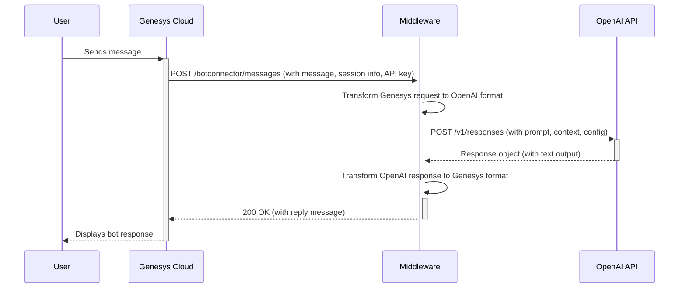

# Genesys Cloud Digital Bot Connector & OpenAI Responses API Middleware

## 1. Overview

This document outlines a middleware service connecting the Genesys Cloud Digital Bot Connector (v2) with the OpenAI Responses API. It creates a secure, scalable bridge for Genesys Cloud Architect flows to use OpenAI's generative models for conversational AI, handling session management, message transformation, security, and configuration.

More info about Genesys Cloud Digital Bot Connector: https://help.mypurecloud.com/articles/about-genesys-digital-bot-connector

More info about OpenAI Responses API: https://platform.openai.com/docs/api-reference/responses

### Key Features

* **Stateless Conversation Management**: Uses OpenAI's `previous_response_id` mapped to Genesys's `botSessionId` for context, avoiding the need to store chat history.
* **Dynamic Configuration**: Leverages Genesys Session Variables to control OpenAI parameters like model and temperature.
* **MCP Tool Integration**: Supports OpenAI's MCP tool (Remote MCP servers). Note that this feature has not been tested, and it is here just for illustrating potential advanced use cases.

## 2. Architecture

The middleware acts as a translation layer, following a simple, linear flow between the Genesys Cloud and OpenAI APIs.



## 3. API Endpoints

The middleware implements the following endpoints to comply with the Genesys Digital Bot Connector specification (https://developer.genesys.cloud/commdigital/textbots/digital-botconnector-customer-api-spec).

### GET /botconnector/bots

Provides Genesys Architect with a list of available "bots," which represent specific OpenAI API configurations (e.g., a particular model).

### GET /botconnector/bots/{botId}

Returns details for a specific bot configuration by its ID.

### POST /botconnector/messages

The core endpoint for processing messages. It receives messages from Genesys, forwards them to OpenAI, and returns the response.

## 4. Request & Response Mapping

### Genesys to OpenAI Request Transformation

The middleware maps the Genesys `IncomingMessagesRequest` to an OpenAI `POST /v1/responses` request. Key transformations include:

| Genesys Field | OpenAI Field | Logic / Notes |
|---|---|---|
| `botSessionId` | `previous_response_id` | Maps `botSessionId` to maintain conversation context. |
| Header `OPENAI_API_KEY` | Header `Authorization` | Formats the key as `Bearer <key>`. |
| `inputMessage.text` | `input` (string) | The user's primary message. |
| `parameters` | `model`, `temperature` | Overrides default OpenAI parameters using session variables. |
| `genesysConversationId` | `metadata` | Maps to `{ "genesys_conversation_id": "<value>" }`. |
| MCP Servers | `tools` | Loads pre-configured MCP server details. |

### OpenAI to Genesys Response Transformation

| OpenAI Field | Genesys Field | Logic / Notes |
|---|---|---|
| `id` | `botSessionId` mapping | Stores the `response.id` for the next turn. |
| `output[0]...text` | `replyMessages` | Maps the text content to a `ReplyMessage` object. |
| `status` | `botState` | Sets to `MoreData` for ongoing chats or `Failed` on error. |
| `error` | `errorInfo` | Maps error details to the `ErrorInfo` object. |

## 5. Configuration

The middleware's behavior is controlled through environment variables, which can be loaded from a `.env.local` file during local development or set directly in the Vercel project settings for production. This approach ensures that sensitive information is kept out of the codebase.

| Variable | Description | Example |
|---|---|---|
| `PORT` | The port the service will run on for local development. | `3000` |
| `LOG_LEVEL` | Sets the logging verbosity. Options are `debug`, `info`, `warn`, or `error`. | `info` |
| `GENESYS_CONNECTION_SECRET` | A strong, unique secret used to validate that incoming requests are from your Genesys Cloud organization. | `your-secure-secret-string` |
| `DEFAULT_OPENAI_MODEL` | The fallback OpenAI model ID to use if one is not specified in the Genesys Architect flow. | `gpt-4o` |
| `DEFAULT_OPENAI_TEMPERATURE` | The default creativity/randomness setting (0.0 to 2.0). Lower values are more deterministic. | `0.7` |
| `MCP_SERVERS_CONFIG_PATH` | An optional path to a JSON file that defines external MCP servers or other OpenAI tools to enable. | `./mcp_config.json` |
| `SESSION_STORE_TYPE` | Specifies the session storage mechanism. Use `memory` for local testing and `redis` for production/serverless environments. | `redis` |
| `KV_REST_API_URL` | The REST API URL for your Redis database (e.g., from Vercel KV or Upstash). Required if `SESSION_STORE_TYPE` is `redis`. | `https://your-db.upstash.io` |
| `KV_REST_API_TOKEN` | The read/write token for your Redis database. Required if `SESSION_STORE_TYPE` is `redis`. | `your-upstash-token` |

### Genesys Session Variables

You can dynamically control the OpenAI model's behavior on a per-interaction basis by setting Session Variables in your Genesys Architect flow. These variables are passed in the `parameters` object of the request.

* `openai_model` (String): Overrides the `DEFAULT_OPENAI_MODEL`. Use this to switch between models like `gpt-4o` and `gpt-4.1` for different use cases within the same flow.
* `openai_temperature` (String): Overrides the `DEFAULT_OPENAI_TEMPERATURE`. This value must be a string that can be parsed into a number (e.g., "0.8").

### Example `mcp_config.json`

This file allows for the dynamic configuration of OpenAI Tools without needing to redeploy the middleware. The application will load the tools defined in this file at runtime.

```json
[
  {
    "type": "mcp",
    "server_label": "deepwiki",
    "server_url": "https://mcp.deepwiki.com/mcp",
    "require_approval": "never"
  },
  {
    "type": "web_search_preview"
  }
]
```

## 6. Security

### Connection Secret

On every incoming request to `POST /botconnector/messages`, the middleware validates the `GENESYS_CONNECTION_SECRET` sent in the request headers. If the secret is missing or does not match the value set in the environment variables, the request is rejected with a `403 Forbidden` status, preventing unauthorized access.

### API Key Handling

The `OPENAI_API_KEY` is securely managed within Genesys Cloud as a credential and is passed in the headers of each request. The middleware extracts this key for the outbound call to the OpenAI API and immediately discards it. **The key is never logged or stored**, ensuring that sensitive credentials do not persist in the middleware layer.

## 7. Session Management

### The Need for a Persistent State Store (Redis)

HTTP-based APIs are inherently **stateless**, meaning each request is independent and has no memory of previous requests. However, chatbot conversations are **stateful** and require context from previous turns to be coherent. This middleware bridges that gap by managing the conversation state.

The core mechanism is mapping the persistent `botSessionId` provided by Genesys to the `previous_response_id` required by the OpenAI Responses API for multi-turn conversations. This mapping must be stored somewhere between requests.

In a **serverless environment** like Vercel, each API request might be handled by a different, short-lived function instance. A simple in-memory variable would be lost as soon as the function finishes. Therefore, an **external, persistent data store is mandatory** for production.

This is why a **Redis database** (such as Vercel KV or Upstash) is used. It provides a fast, reliable key-value store that persists the session mapping across countless independent serverless function invocations, enabling a seamless and stateful conversation for the end-user.

### Implementation Details

* **Storage Options**: For local development, the application can use a simple in-memory store. For all production and serverless deployments, a persistent Redis database is required.
* **Key-Value Structure**:
  * **Key**: `genesys_bot_session:<botSessionId>`
  * **Value**: `<latest_openai_response_id>`
* **Session Expiration (TTL)**: The middleware uses the `botSessionTimeout` value from the Genesys request to set a Time-to-Live (TTL) on each session entry. This automatically clears stale sessions from the store, preventing data buildup.

## 8. Deployment and Setup

### Vercel Deployment

This middleware is optimized for deployment on Vercel's serverless platform.

1. **Link Repository**: Connect your GitHub repository to a new Vercel project.
2. **Set Environment Variables**: In the Vercel project dashboard, navigate to **Settings > Environment Variables**. Add all the necessary variables from the configuration table above, such as `GENESYS_CONNECTION_SECRET` and `SESSION_STORE_TYPE=redis`.
3. **Configure Redis**: Navigate to the **Storage** tab in your Vercel dashboard and create a new **KV (Redis)** database. Connect it to your project, and Vercel will automatically create and link the `KV_REST_API_URL` and `KV_REST_API_TOKEN` environment variables.
4. **Deploy**: Push your code to the main branch to trigger a production deployment.

### Genesys Cloud Configuration

In your Genesys Cloud organization, set up the Digital Bot Connector integration:

1. **Bot Connector URI**: Enter the full URL of your deployed Vercel application, pointing to the API base path.
   * **Example**: `https://your-app-name.vercel.app/api/botconnector`
2. **Set Credentials**: Configure the necessary authentication credentials (`OPENAI_API_KEY` and `GENESYS_CONNECTION_SECRET`) in your Genesys Cloud organization:


3. Example invocation from Inbound Message Flow:


