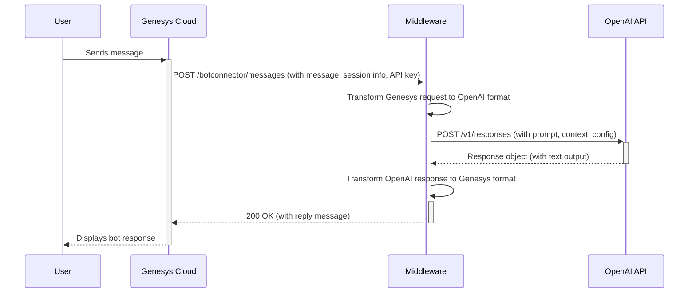

# Middleware: Genesys Cloud Digital Bot Connector & OpenAI Responses API

## 1. Overview

This document outlines the architecture and implementation details for a middleware service that connects the Genesys Cloud Digital Bot Connector (v2) with the OpenAI Responses API. The goal is to create a secure, scalable, and configurable bridge that allows Genesys Cloud Architect flows to leverage the power of OpenAI's generative models for conversational AI.

The middleware will handle session management, message transformation, security, and configuration, enabling a seamless and stateful conversation between an end-user on a Genesys messaging channel and an OpenAI model.

### Key Features

- **Stateless Conversation Management**: Leverages OpenAI's `previous_response_id` mapped to Genesys's `botSessionId` to maintain conversation context without storing chat history.

- **Dynamic Configuration**: Uses Genesys Session Variables to control OpenAI parameters like model and temperature on a per-flow basis.

- **Secure Credential Handling**: The OpenAI API Key is passed securely from the Genesys Credential Manager via request headers, not stored in the middleware.

- **File & Tool Integration**: Supports PDF file attachments and enables the use of OpenAI's powerful tools, specifically Remote MCP (Model Context Protocol) servers.

- **Production-Ready**: Includes guidelines for logging, error handling, and containerization.

## 2. Architecture

The system operates on a simple, linear flow. The middleware acts as a translation layer between the two distinct APIs.



## 3. API Endpoints (Middleware Implementation)

The middleware MUST implement the following endpoints to be compliant with the Genesys Digital Bot Connector specification.

### GET /botconnector/bots

This endpoint provides Genesys Architect with a list of available "bots". In our context, a "bot" represents a specific configuration for the OpenAI API (e.g., a specific model or a set of initial instructions). This should be configurable within the middleware.

**Response Body Example:**

The response must be a JSON object containing a list of bots. The `id` can be used to reference a specific OpenAI model (e.g., `gpt-4.1`). The intents and entities can be minimal, as the primary logic resides in OpenAI.

```json
{
  "entities": [
    {
      "id": "gpt-4o",
      "name": "OpenAI GPT-4o",
      "provider": "OpenAI",
      "description": "A powerful and fast multimodal model from OpenAI.",
      "versions": [
        {
          "version": "latest",
          "supportedLanguages": ["en-us", "es", "fr"],
          "intents": [
            {
              "name": "DefaultIntent",
              "entities": []
            }
          ]
        }
      ]
    },
    {
      "id": "gpt-4.1",
      "name": "OpenAI GPT-4.1",
      "provider": "OpenAI",
      "description": "A highly capable model for complex reasoning from OpenAI.",
      "versions": [
        {
          "version": "latest",
          "supportedLanguages": ["en-us", "es", "fr"],
          "intents": [
            {
              "name": "DefaultIntent",
              "entities": []
            }
          ]
        }
      ]
    }
  ]
}
```

### GET /botconnector/bots/{botId}

Returns the details for a specific bot configuration by its ID. The implementation can filter the static list from the `GET /botconnector/bots` endpoint.

### POST /botconnector/messages

This is the core endpoint for message processing. It receives messages from Genesys and forwards them to OpenAI, then returns OpenAI's response.

## 4. Request & Response Mapping

### Genesys to OpenAI Request Transformation

The middleware must map the incoming Genesys `IncomingMessagesRequest` to an OpenAI `POST /v1/responses` request body.

| Genesys Field (IncomingMessagesRequest) | OpenAI Field (POST /v1/responses) | Logic / Notes |
|------------------------------------------|-----------------------------------|---------------|
| `botSessionId` | `previous_response_id` | Crucial for context. The middleware must maintain a mapping of `botSessionId` to the latest OpenAI `response.id`. For the first message in a session, this field is null. |
| Header `OPENAI_API_KEY` (from Credentials) | Header `Authorization` | Extract the key from the request header and format it as `Bearer <key>`. |
| `inputMessage.text` | `input` (string) | The primary user message. |
| `inputMessage.content` (for attachments) | `input` (array of items) | If an attachment is present, transform the input into an array. Genesys provides a URL for the attachment. The middleware maps this to an `input_file` object. Assume PDFs only. See OpenAI docs for `input_file` structure. |
| `parameters` (Session Variables) | `model`, `temperature`, etc. | Check for keys like `openai_model`, `openai_temperature` in the parameters map and use them to override defaults in the OpenAI request. The `botId` from Genesys can serve as the default model. |
| `genesysConversationId` | `metadata` | Create a map: `{ "genesys_conversation_id": "<value>" }`. |
| Configured MCP Servers | `tools` | Load pre-configured MCP server details and add them to the tools array in the request. See the configuration section below. |

### Example Input Transformation for File Attachment

If the Genesys message contains text and a PDF attachment, the OpenAI input should look like this:

```json
"input": [
    {
        "role": "user",
        "content": [
            {
                "type": "input_file",
                "file_url": "https://url.from.genesys/attachment.pdf"
            },
            {
                "type": "input_text",
                "text": "What does this document say about project alpha?"
            }
        ]
    }
]
```

### OpenAI to Genesys Response Transformation

| OpenAI Field (Response Object) | Genesys Field (IncomingMessagesResponse) | Logic / Notes |
|--------------------------------|-------------------------------------------|---------------|
| `id` | `botSessionId` mapping | Store this id. The next message from this user will use this as `previous_response_id`. |
| `output[0].content[0].text` | `replyMessages` | Assuming the first output is a message, map its text content. Create a `ReplyMessage` object of type `Text`. |
| `status` | `botState` | If status is `completed`, `botState` should be `MoreData` to keep the session open for multi-turn chat. If status is `failed`, set `botState` to `Failed`. A `botState` of `Complete` would end the session; use this only if a specific "end conversation" intent is detected (not applicable for this general LLM setup). |
| `error` | `errorInfo` | If an error occurs, map the `error.code` and `error.message` to Genesys's `ErrorInfo` object and set `botState` to `Failed`. |

## 5. Configuration

The middleware should be configurable via environment variables or a `config.json` file.

| Variable | Description | Example |
|----------|-------------|---------|
| `PORT` | The port the service will run on. | `3000` |
| `LOG_LEVEL` | Logging verbosity. | `info` |
| `GENESYS_CONNECTION_SECRET` | The shared secret to validate requests from Genesys Cloud. | `your-secure-secret-string` |
| `DEFAULT_OPENAI_MODEL` | The default model to use if not specified in session variables. | `gpt-4o` |
| `DEFAULT_OPENAI_TEMPERATURE` | The default temperature if not specified. | `0.7` |
| `MCP_SERVERS_CONFIG_PATH` | Path to a JSON file defining MCP servers to enable. | `./mcp_config.json` |
| `SESSION_STORE_TYPE` | Type of session store (memory or redis). | `redis` |
| `KV_REST_API_URL` | Upstash Redis REST URL. | `https://your-upstash-endpoint.upstash.io` |
| `KV_REST_API_TOKEN` | Upstash Redis REST token. | `your-upstash-token` |

### mcp_config.json Example

This file allows for dynamic configuration of OpenAI Tools without redeploying the middleware.

```json
[
  {
    "type": "mcp",
    "server_label": "deepwiki",
    "server_url": "https://mcp.deepwiki.com/mcp",
    "require_approval": "never"
  },
  {
    "type": "web_search_preview"
  }
]
```

## 6. Security

### Connection Secret
On every incoming request to `POST /messages`, the middleware MUST validate the connection secret sent by Genesys in the headers. Reject any request with a `403 Forbidden` if the secret is missing or invalid.

### API Key Handling
The OpenAI API Key is expected in a header like `OPENAI_API_KEY` or `Authorization` from the Genesys Credential system. The middleware MUST extract this key and use it for the outbound call to OpenAI. Do not log this key or store it anywhere.

### Input Sanitization
While OpenAI has its own safeguards, consider basic sanitization or validation of inputs if required by security policies.

## 7. Session Management

A key-value store (like Redis for production, or an in-memory map for development) is required to map the Genesys `botSessionId` to the latest OpenAI `response.id`.

- **Key**: `genesys_bot_session:<botSessionId>`
- **Value**: `<latest_openai_response_id>`
- **TTL (Time to Live)**: The TTL for each entry should be set based on the `botSessionTimeout` value provided by Genesys in the `IncomingMessagesRequest`. This ensures that stale sessions are automatically cleared.

## 8. Error Handling

### OpenAI Errors
Map OpenAI API errors (e.g., 4xx, 5xx status codes) to the appropriate Genesys error response. Return a 5xx status code to Genesys for OpenAI server errors, which may trigger a retry. Return a 4xx for client-side errors (e.g., invalid configuration).

### Middleware Errors
For internal middleware errors, return a generic 500 error to Genesys and log the detailed error stack trace for debugging. The response to Genesys should include the `errorInfo` object where possible.

## Deployment on Vercel

This middleware is designed to be deployed on Vercel serverless functions using Next.js API routes.

- Set environment variables in Vercel dashboard, including GENESYS_CONNECTION_SECRET, KV_REST_API_URL (Upstash REST URL, e.g. https://your-db.upstash.io), KV_REST_API_TOKEN (Upstash REST token), SESSION_STORE_TYPE=redis, etc.
- For Redis, use Upstash. Create a free Upstash Redis DB from your Vercel dashboard ("Storage" tab) and connect it to your middleware project. db env vars will be automatically linked.
- Deploy via git push to Vercel-linked repository.

For local development, use `npm run dev`. Ensure .env.local has necessary vars like GENESYS_CONNECTION_SECRET.

### Genesys Cloud Setup

In Genesys Cloud, when creating the Digital Bot Connector integration:

- Set Credentials:
  - Field Name: OPENAI_API_KEY, Value: Your OpenAI key
  - Field Name: GENESYS_CONNECTION_SECRET, Value: Your secret (matches env var)

- Bot Connector URI: Your Vercel deployment URL, e.g. https://your-app.vercel.app/botconnector

Activate the integration before use.
